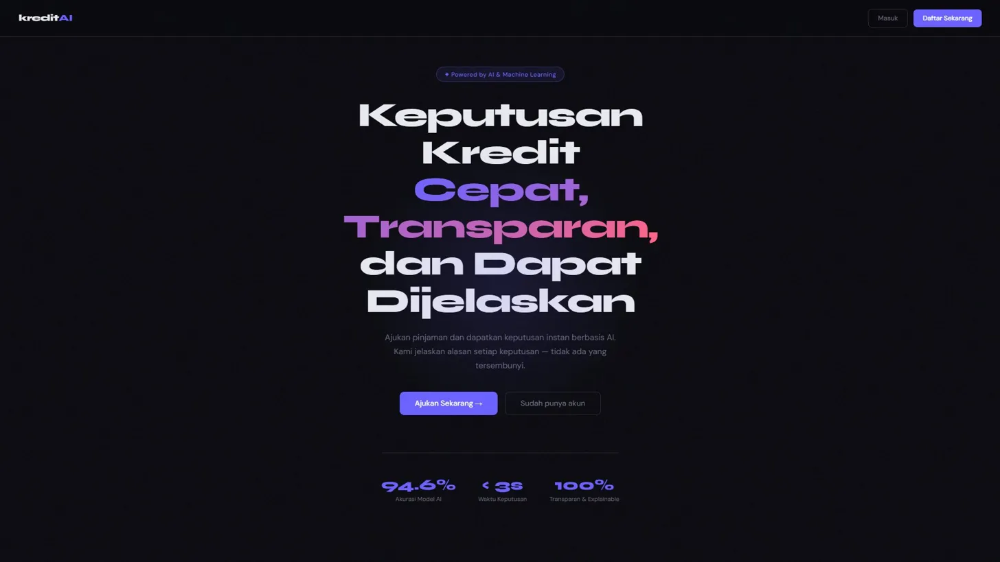
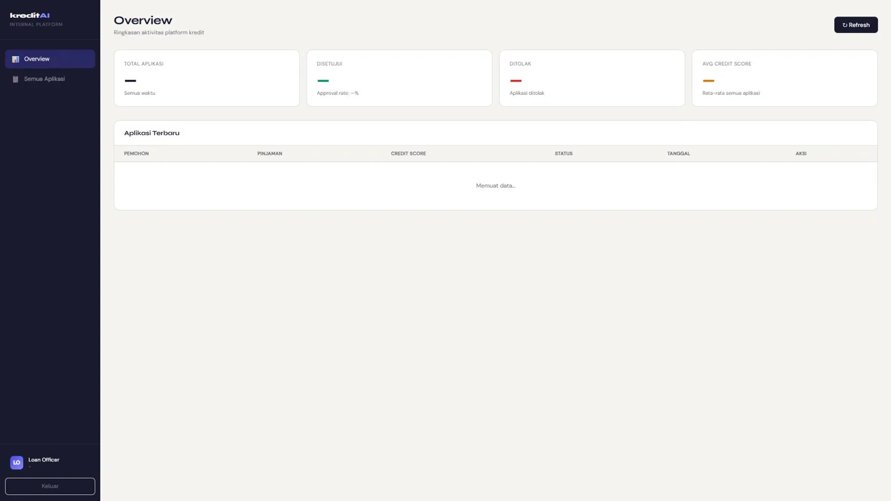

# 🏦 Credit Risk Platform

> **Explainable AI Credit Decisioning** — XGBoost + SHAP + RAG + Qwen2.5 + Multi-Agent LangGraph

[](https://python.org)
[](https://fastapi.tiangolo.com)
[](https://docker.com)
[](https://xgboost.ai)
[](https://langchain-ai.github.io/langgraph)

---

## 📸 Screenshots

### Portal Nasabah (External)


### Dashboard Loan Officer (Internal)

---

## 🎯 Tentang Project

Platform penilaian risiko kredit berbasis **Explainable AI** yang menggabungkan machine learning tradisional dengan teknologi LLM modern. Setiap keputusan kredit dapat dijelaskan secara transparan kepada nasabah menggunakan bahasa natural.

### Masalah yang Diselesaikan
Bank konvensional sering menolak atau menyetujui kredit tanpa penjelasan yang jelas. Platform ini memberikan:
- **Keputusan instan** berbasis ML (< 3 detik)
- **Penjelasan transparan** mengapa disetujui/ditolak
- **Multi-agent analysis** untuk keputusan yang lebih komprehensif
- **Monitoring otomatis** untuk mendeteksi model drift

---

## 🏗️ Architecture

```
┌─────────────────────────────────────────────────────────────┐
│                     Client Layer                             │
│   Portal External (Nasabah)    Portal Internal (Officer)     │
└──────────────────┬──────────────────────┬───────────────────┘
                   │                      │
┌──────────────────▼──────────────────────▼───────────────────┐
│                   FastAPI Backend                            │
│  /auth  /score  /chat  /agent  /officer  /monitor           │
└──────┬──────────┬────────────┬──────────┬────────────────────┘
       │          │            │          │
   ┌───▼───┐  ┌──▼───┐  ┌────▼────┐  ┌──▼──────┐
   │XGBoost│  │ RAG  │  │LangGraph│  │Evidently│
   │+ SHAP │  │+Qwen │  │ Agents  │  │Telegram │
   └───────┘  └──────┘  └─────────┘  └─────────┘
       │          │
   ┌───▼──────────▼───────────────────────────────┐
   │         Data Layer                            │
   │  PostgreSQL    Redis    ChromaDB    MLflow    │
   └───────────────────────────────────────────────┘
```

---

## ✨ Fitur Utama

### 🤖 ML Scoring Engine
- **XGBoost** model dengan AUC **0.9465**
- **SHAP** explainability — setiap keputusan dapat dijelaskan
- Training pada dataset 32.000+ aplikasi kredit nyata
- **MLflow** tracking untuk experiment management

### 🧠 RAG + Local LLM
- **ChromaDB** vector database untuk semantic search
- **Qwen2.5 7B** via Ollama — berjalan lokal, gratis, privat
- Penjelasan natural language dalam **Bahasa Indonesia**
- Dokumen kebijakan kredit sebagai referensi AI

### 🤝 Multi-Agent System (LangGraph)
Pipeline 4 agent bekerja berurutan:
```
Risk Analyst → Policy Checker → Fraud Detector → Report Writer
```
- **Risk Analyst** — ML scoring + SHAP analysis
- **Policy Checker** — validasi kebijakan via RAG
- **Fraud Detector** — deteksi anomali rule-based
- **Report Writer** — keputusan final + penjelasan

### 🖥️ Dual Portal
- **Portal Nasabah** — submit aplikasi, lihat hasil, chat AI
- **Dashboard Loan Officer** — kelola aplikasi, override keputusan, analisis AI

### 📊 Monitoring & Alerting
- **Drift Detection** berbasis PSI (Population Stability Index)
- **Telegram Bot** notifikasi real-time
- Health check endpoint untuk semua komponen
- Daily report otomatis

---

## 🛠️ Tech Stack

| Layer | Technology |
|-------|-----------|
| **Backend API** | FastAPI, Uvicorn, SQLAlchemy |
| **Database** | PostgreSQL, Redis |
| **ML** | XGBoost, SHAP, Scikit-learn, MLflow |
| **LLM** | Qwen2.5 7B via Ollama |
| **Vector DB** | ChromaDB + Sentence Transformers |
| **Agentic AI** | LangGraph, LangChain |
| **Monitoring** | Evidently AI, Telegram Bot |
| **DevOps** | Docker, Docker Compose |
| **Auth** | JWT (python-jose) + bcrypt |

---

## 🚀 Quick Start

### Prerequisites
- Python 3.11+
- Docker Desktop
- [Ollama](https://ollama.com) dengan model `qwen2.5:7b`

### 1. Clone Repository
```bash
git clone https://github.com/Opticinn/credit-risk-platform.git
cd credit-risk-platform
```

### 2. Setup Environment
```bash
# Copy environment template
copy .env.example .env

# Edit .env dan isi:
# - SECRET_KEY (random string panjang)
# - TELEGRAM_BOT_TOKEN (dari @BotFather)
# - TELEGRAM_CHAT_ID (dari getUpdates)
```

### 3. Install Dependencies
```bash
python -m venv venv
venv\Scripts\activate  # Windows
pip install -r requirements.txt
```

### 4. Download & Train Model
```bash
# Download dataset
python data/download_dataset.py

# Train model (±3 menit)
python data/train_model.py
```

### 5. Download LLM
```bash
ollama pull qwen2.5:7b
```

### 6. Jalankan dengan Docker
```bash
docker compose up
```

### 7. Akses Portal
```bash
python -m http.server 5500
```
- **Portal Nasabah:** http://localhost:5500/portals/external/index.html
- **Dashboard Officer:** http://localhost:5500/portals/internal/index.html
- **API Docs:** http://localhost:8000/docs

---

## 📁 Project Structure

```
credit-risk-platform/
├── app/
│   ├── api/                    # Route handlers
│   │   ├── auth.py             # Register, login, JWT
│   │   ├── score.py            # Credit scoring endpoint
│   │   ├── chat.py             # AI chat endpoint
│   │   ├── officer.py          # Loan officer dashboard API
│   │   ├── monitor.py          # Monitoring & health check
│   │   └── agent.py            # Multi-agent endpoint
│   ├── models/                 # SQLAlchemy ORM models
│   │   ├── user.py
│   │   ├── application.py
│   │   ├── score.py
│   │   └── audit_log.py
│   ├── services/
│   │   ├── ml/
│   │   │   └── scoring.py      # XGBoost inference service
│   │   ├── rag/
│   │   │   └── rag_service.py  # ChromaDB + Qwen2.5 RAG
│   │   ├── agents/
│   │   │   ├── state.py        # LangGraph shared state
│   │   │   ├── agents.py       # 4 specialized agents
│   │   │   └── graph.py        # LangGraph workflow
│   │   └── monitoring/
│   │       ├── alerting.py     # Telegram alerts
│   │       └── drift_detector.py # PSI drift detection
│   ├── config.py               # Settings dari .env
│   ├── database.py             # DB engine & session
│   └── main.py                 # FastAPI entrypoint
├── data/
│   ├── models/                 # Trained ML models (.pkl)
│   ├── policy_docs/            # Dokumen kebijakan kredit (.md)
│   ├── download_dataset.py     # Download dari Kaggle
│   └── train_model.py          # Training script
├── portals/
│   ├── external/               # Portal nasabah (HTML/CSS/JS)
│   └── internal/               # Dashboard loan officer
├── docs/
│   └── screenshots/            # Screenshots untuk README
├── Dockerfile
├── docker-compose.yml
├── requirements.txt
└── .env.example
```

---

## 🔌 API Endpoints

### Auth
| Method | Endpoint | Deskripsi |
|--------|----------|-----------|
| POST | `/auth/register` | Daftar user baru |
| POST | `/auth/login` | Login, dapat JWT token |
| GET | `/auth/me` | Profil user aktif |

### Scoring
| Method | Endpoint | Deskripsi |
|--------|----------|-----------|
| POST | `/score/apply` | Submit aplikasi kredit |
| GET | `/score/history` | Riwayat aplikasi |
| GET | `/score/{id}` | Detail satu aplikasi |

### AI Chat
| Method | Endpoint | Deskripsi |
|--------|----------|-----------|
| POST | `/chat/explain/{id}` | Penjelasan keputusan |
| POST | `/chat/ask` | Tanya bebas seputar kredit |

### Multi-Agent
| Method | Endpoint | Deskripsi |
|--------|----------|-----------|
| POST | `/agent/decide` | Full multi-agent pipeline |

### Monitoring
| Method | Endpoint | Deskripsi |
|--------|----------|-----------|
| GET | `/monitor/health` | Health check semua komponen |
| GET | `/monitor/drift` | Jalankan drift detection |
| GET | `/monitor/stats/daily` | Statistik harian + Telegram |
| POST | `/monitor/alert/test` | Test Telegram alert |

---

## 📊 Model Performance

| Metric | Score |
|--------|-------|
| **ROC-AUC** | **0.9465** |
| Precision | 0.8271 |
| Recall | 0.7811 |
| F1-Score | 0.8035 |

Training data: 32.000+ aplikasi kredit (Kaggle Credit Risk Dataset)

---

## 🔐 Role-Based Access

| Role | Akses |
|------|-------|
| `applicant` | Submit aplikasi, lihat hasil sendiri, chat AI |
| `loan_officer` | Semua aplikasi, override keputusan, dashboard |
| `admin` | Full access semua fitur |

---

## 📱 Telegram Monitoring

Bot otomatis mengirim notifikasi untuk:
- 🚀 Server startup
- 🚨 Model drift terdeteksi
- 📋 Laporan harian
- 🔴 Error kritis

---

## 🗺️ Roadmap

- [x] Phase 1 — FastAPI + PostgreSQL + JWT Auth
- [x] Phase 2 — XGBoost + SHAP + MLflow
- [x] Phase 3 — RAG + Qwen2.5 + AI Chat
- [x] Phase 4 — Dual Portal UI
- [x] Phase 5 — Monitoring + Telegram Alerts
- [x] Phase 6 — Docker Containerization
- [x] Phase 7 — Multi-Agent LangGraph
- [ ] Phase 8 — Deploy ke Cloud (GCP Cloud Run)
- [ ] Phase 9 — CI/CD Pipeline

---

## 👨‍💻 Author

**Rafli Fauzi**
- GitHub: [@Opticinn](https://github.com/Opticinn)

---

## 📄 License

MIT License — feel free to use for learning and portfolio purposes.